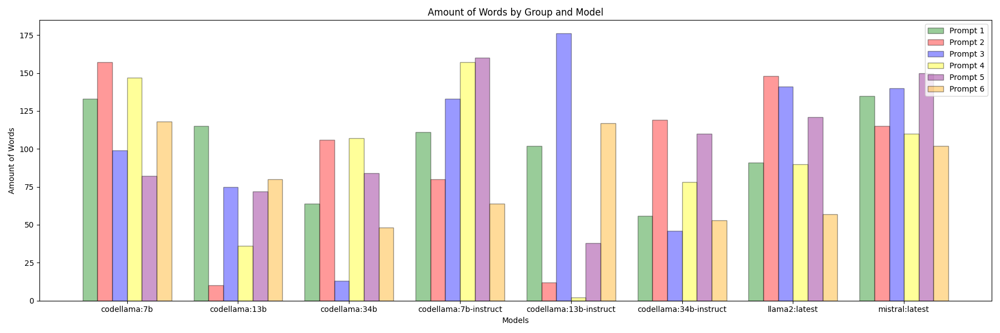

# LLM Profiler

This repository contains a suite of Python scripts designed to profile the performance of command-line tools, automate the process of sending prompts to commands, and generate visualizations to analyze CPU and memory usage. It is intended for developers and researchers who need to monitor and optimize the performance of their applications.

#### Project Structure
- `profiler.py`: Monitors and logs CPU and memory usage of a specified command.
- `give_prompts.py`: Automates sending prompts from a CSV file to a command and integrates with visualization generation.
- `create_visualisations.py`: Generates plots and summaries of CPU and memory usage based on logged data.
- `run_all_models.py`: Runs `give_prompts.py` for all models then collates data into graphs found in the `all_models` folder 
- `constants.py`: Defines constants used across the scripts.
- `requirements.txt`: Lists the Python package dependencies for the project.

#### Installation

1. Clone this repository to your local machine.
2. Ensure you have Python 3.6+ installed.
3. Ensure you have [ollama](https://github.com/ollama/ollama) installed
4. Install the required dependencies by running `pip install -r requirements.txt` in your terminal.

#### Usage

**Prefix**

Before profiling a model please insure it has been installed and is working with ollama

You can do this by using the command

```bash
ollama run <model_name>
```

A full list of these models can be found on the [ollama website](https://ollama.com/)

##### Profiling a Command
To profile a command, run `profiler.py` with the command you wish to monitor as an argument. You can optionally specify a prompt file to influence the command's operation:

```bash
python profiler.py "<command_to_profile>" 
```

##### Sending Prompts to a Command
To send prompts to a command and visualize the performance, use `give_prompts.py` with the appropriate CSV file:

```bash
python give_prompts.py "<prompt_file_name.csv>" "<llm_model_name>"
```

This will also trigger the visualization process, creating plots and summaries of the performance metrics.

##### Run a prompt file for all models

To run for all installed models and create graphs that collate the data from each models so that they can be compared use this command:

```bash
python run_all_models.py "<prompt_file_name.csv>"
```

This will create the output in the `all_models` folder 

##### Generating Visualizations
Visualizations are automatically generated by `give_prompts.py`, but you can also manually generate them using `create_visualisations.py` if you have existing CSV logs:

```bash
python create_visualisations.py "<path_to_cpu_usage_csv>" "<path_to_input_output_csv>"
```

#### Creating New Prompt Files
Prompt files are CSV files containing commands or inputs you wish to send to the profiled application. To create a new prompt file:

1. Format your prompts in a CSV file, with each prompt in a new line.
2. Each prompt should be delimetered with `|||` 
3. Use the filename format `prompt_files/<name>_prompts.csv` for organization.

## Output

When the `give_prompts.py` file is run it will create the following files in the following structure 

```
├── output
│   ├── <name of prompt file>
│   │   ├── all_models
│   │   │   ├── <timestamp of when run_all_models.py was run>
│   │   │   │   ├── amount_of_words.png
│   │   │   │   ├── input_response_table.md
│   │   │   │   ├── max_cpu_usage.png
│   │   │   │   ├── max_memory_usage.png
│   │   │   │   ├── time_taken.png
│   │   │   │   ├── words_per_second.png
│   │   ├── <model>
│   │   │   ├── <timestamp of when give_prompts.py was run>
│   │   │   │   ├── cpu_usage.csv
│   │   │   │   ├── memory_usage.csv
│   │   │   │   ├── input_response_file.csv
│   │   │   │   ├── visualisations
│   │   │   │   │   ├── cpu_usage.png
│   │   │   │   │   ├── memory_usage.png
│   │   │   │   │   ├── input_output_memory_change_table.md
```


### Explination of Output Files 

| **File Name**                                      | Explanation                                                  |
| -------------------------------------------------- | ------------------------------------------------------------ |
| cpu_usuage.csv                                     | This is a CSV of the CPU Usage while the program is running<br />Titles are `Timestamp` and `CPU Usage (%)` |
| memory_usage.csv                                   | This CSV shows the `Timestamp`, `Memory Usage (MB)` and `Virtual Memory Usage (MB)` while the program is running |
| input_response_file.csv                            | This file is delimetered with `\|\|\|` and each row is:<br />- The timestamp of when the command was inputted <br />- What prompt was inputted <br />- The timestamp of when the output stopped<br />- The output from the LLM |
| visualisations/cpu_usage.png                       | A line graph of the CPU Usage taken from `cpu_usuage.csv` <br />Here the different prompts are visualised by different colour bands.<br />With the band begininging when the prompt was inputted and ending when the output finished. <br />This data is taken from the `input_response_file.csv` |
| visualisations/memory_usage.png                    | A line graph of the Memory Usage taken from `memory_usage.csv` <br />This contains two graphs which are for `Memory Usage (MB)` and `Virtual Memory Usage (MB)`<br /><br />Like the `visualisations/cpu_usage.png` this also has coloured bands denoting when the prompts were run |
| visualisations/input_output_memory_change_table.md | This is a markdown table showing the any other relavent data |


### Example graphs in `visualisations`

#### `cpu_usage.png`


#### `memory_usage.png`

### 

### Example graphs in `all_models`

#### `words_per_second.png`


#### `amount_of_words.png`



#### `max_cpu_usage.png`


#### `max_memory_usage.png`

